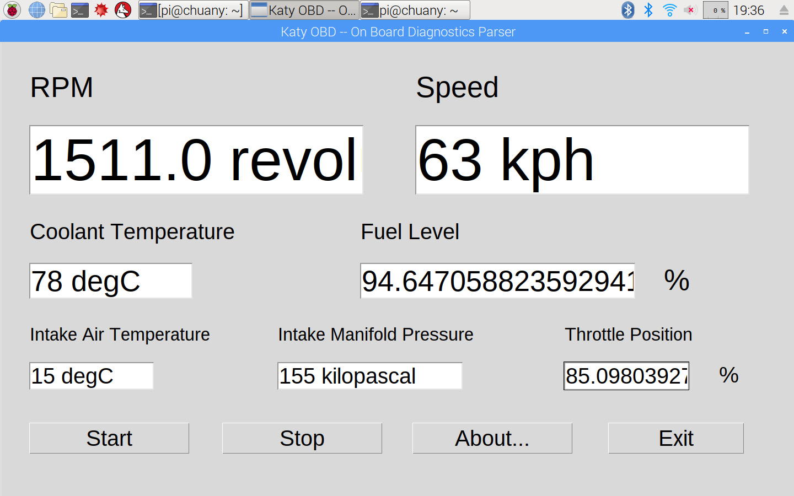
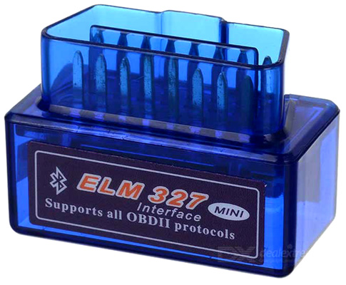

# Katy OBD
A dialog-based ECU parsing tools of vehicle via OBD.

***Chuan Yang*** (<yangc@sj-hospital.org>)

[](https://github.com/YangChuan80/KatyOBD)
[](LICENSE)
[](https://github.com/YangChuan80/WillowbendDICOM/raw/master/Installer/WillowbendDICOM_Installer.exe?raw=true)
[](README.md)
[](https://github.com/YangChuan80)

## Introduction
**Electronic Control Unit** **(ECU)**: In automotive electronics, ECU is any embedded system that controls one or more of the electrical system or subsystems in a transport vehicle.Types of ECU include Electronic/engine Control Module (ECM), Powertrain Control Module (PCM), Transmission Control Module (TCM), Brake Control Module (BCM or EBCM), Central Control Module (CCM), Central Timing Module (CTM), General Electronic Module (GEM), Body Control Module (BCM), Suspension Control Module (SCM), control unit, or control module. Taken together, these systems are sometimes referred to as the car's computer (Technically there is no single computer but multiple ones.) Sometimes one assembly incorporates several of the individual control modules (PCM is often both engine and transmission).

**On-board diagnostics** (**OBD**) is an automotive term referring to a vehicle's self-diagnostic and reporting capability. OBD systems give the vehicle owner or repair technician access to the status of the various vehicle subsystems. Modern OBD implementations use a standardized digital communications port to provide real-time data in addition to a standardized series of diagnostic trouble codes, or DTCs, which allow one to rapidly identify and remedy malfunctions within the vehicle.

***Katy OBD*** is a dialog-based application performing the parser of data from ECU (Electronic Control Unit) built in cars via OBD port with a Bluetooth OBD connector. It can provide the information of ECU parameters including: 
- **RPM** 
- **Speed**
- **Coolant Temperature**
- **Fuel Level**
- **Intake Air Temperature**
- **Intake Manifold Pressure**
- **Throttle Position**, 

The GUI should be like this: 

[](README.md)

## Run the Program
- Install the OBD module of Python.
```
$ pip install obd
```
- Download **[KatyOBD.py](https://raw.githubusercontent.com/YangChuan80/KatyOBD/master/KatyOBD.py)** file from **[here](https://raw.githubusercontent.com/YangChuan80/KatyOBD/master/KatyOBD.py)**, which is a Python source file only. 

- After downloading, run the **KatyOBD.py** to go as below:

```
$ python KatyOBD.py
```
- The GUI of Katy OBD will run.

## Instructions
- Connect the OBD port with **ELM327 Bluetooth OBD connector**. The position of the OBD connector of your car is located under the dashboard in your cockpit.


[](README.md)

- Ignite your car.
- Connect the OBD via Bluetooth using your **Raspberry Pi**.
- Run ***Katy OBD*** as previously mentioned. When ***Katy OBD*** pop up, click **Start** button to initiate the extraction process of vehicle data, including RPM, speed, coolant temperature, fuel level, intake air temperature and throttle position information. 
- When click the **Stop** button, you'll stop the parsing process. 

## License
The MIT License (MIT)

Copyright (c) 2017 Chuan Yang

Permission is hereby granted, free of charge, to any person obtaining a copy
of this software and associated documentation files (the "Software"), to deal
in the Software without restriction, including without limitation the rights
to use, copy, modify, merge, publish, distribute, sublicense, and/or sell
copies of the Software, and to permit persons to whom the Software is
furnished to do so, subject to the following conditions:

The above copyright notice and this permission notice shall be included in all
copies or substantial portions of the Software.

THE SOFTWARE IS PROVIDED "AS IS", WITHOUT WARRANTY OF ANY KIND, EXPRESS OR
IMPLIED, INCLUDING BUT NOT LIMITED TO THE WARRANTIES OF MERCHANTABILITY,
FITNESS FOR A PARTICULAR PURPOSE AND NONINFRINGEMENT. IN NO EVENT SHALL THE
AUTHORS OR COPYRIGHT HOLDERS BE LIABLE FOR ANY CLAIM, DAMAGES OR OTHER
LIABILITY, WHETHER IN AN ACTION OF CONTRACT, TORT OR OTHERWISE, ARISING FROM,
OUT OF OR IN CONNECTION WITH THE SOFTWARE OR THE USE OR OTHER DEALINGS IN THE
SOFTWARE.
