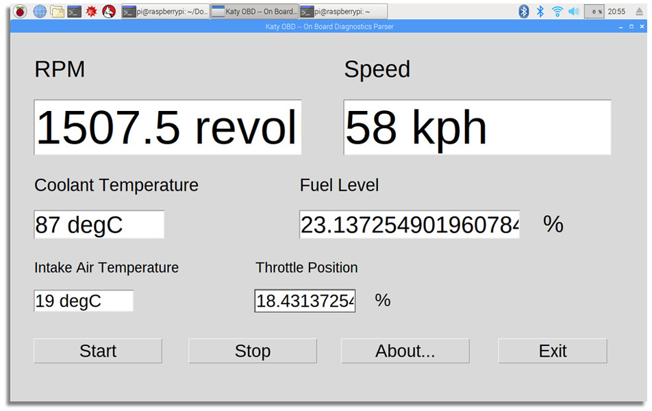

# Katy OBD
A dialog-based on-board diagnositcs parsing tools of vehicle.

***Chuan Yang*** (<yangc@sj-hospital.org>)

[](https://github.com/YangChuan80/KatyOBD)
[](LICENSE)
[](https://github.com/YangChuan80/WillowbendDICOM/raw/master/Installer/WillowbendDICOM_Installer.exe?raw=true)
[](README.md)
[](https://github.com/YangChuan80)

## Introduction
**Electronic Control Unit** **(ECU)**: In automotive electronics, ECU is any embedded system that controls one or more of the electrical system or subsystems in a transport vehicle.Types of ECU include Electronic/engine Control Module (ECM), Powertrain Control Module (PCM), Transmission Control Module (TCM), Brake Control Module (BCM or EBCM), Central Control Module (CCM), Central Timing Module (CTM), General Electronic Module (GEM), Body Control Module (BCM), Suspension Control Module (SCM), control unit, or control module. Taken together, these systems are sometimes referred to as the car's computer (Technically there is no single computer but multiple ones.) Sometimes one assembly incorporates several of the individual control modules (PCM is often both engine and transmission).

**On-board diagnostics** (**OBD**) is an automotive term referring to a vehicle's self-diagnostic and reporting capability. OBD systems give the vehicle owner or repair technician access to the status of the various vehicle subsystems. Modern OBD implementations use a standardized digital communications port to provide real-time data in addition to a standardized series of diagnostic trouble codes, or DTCs, which allow one to rapidly identify and remedy malfunctions within the vehicle.

***Katy OBD*** is a dialog-based application performing the parser of data from ECU (Electronic Control Unit) installed in cars via OBD port with OBD connector.

[](README.md)

## Installation from Binaries
- Download **[CharlestonPark_Installer.exe](https://github.com/YangChuan80/CharlestonPark/blob/master/CharlestonPark_Installer.exe?raw=true)** file from **[here](https://github.com/YangChuan80/CharlestonPark/blob/master/CharlestonPark_Installer.exe?raw=true)**, which is a NSIS installation file only used in Windows platform. 
- After downloading, you can install it directly. When finished, a folder with the same name have been made. Enter the folder CharlestonPark, run the **CharlestonPark.EXE** to go!
- This option is for ordinary users, who are not required to possess any knowledge of Python programming language or to have Python interpreter configured on their computers.
- CharlestonPark can also be run on Mac OSX and Linux.

## Installation from Source
This option is only adopted by Python specialist. 

After you complete the CharlestonPark.py and database files download, run it:
```
python CharlestonPark.py
```
Python interpreter has to be Python 3.4 or later.

- **Setuptools & Pyinstaler**
 - If you'd like to use **PyInstaller**, you should downgrade your **setuptools** module to **19.2**.

To perform frozen binary, do this:
```
pyinstaller CharlestonPark.py -w
```

## Instructions
- Click **Browse** button to browse the information of all samples and patients. 
- When the information lists, you can double click the row, then the detailed information will display in the lower part of the dialog. 
- If you want change the detailed information, after you edit it, you can click the **Update**. After the dialog pop up, your edited changes will update to the database.
- You also can create a new record of sample and/or patient by clicking **New Sample...** and/or **New Patient...**.
- Click **Samples...** or **Patients...** button on the right, you can browse, change and delete the information of sample and patient at one time from the database.
- Besides, the search services are available in main dialogue and **Samples...**/**Patients...** dialogue. ***Charleston Park*** provide patient name search, in-patient ID search and sample ID search options to let you to query the database. 

## License
The MIT License (MIT)

Copyright (c) 2017 Chuan Yang

Permission is hereby granted, free of charge, to any person obtaining a copy
of this software and associated documentation files (the "Software"), to deal
in the Software without restriction, including without limitation the rights
to use, copy, modify, merge, publish, distribute, sublicense, and/or sell
copies of the Software, and to permit persons to whom the Software is
furnished to do so, subject to the following conditions:

The above copyright notice and this permission notice shall be included in all
copies or substantial portions of the Software.

THE SOFTWARE IS PROVIDED "AS IS", WITHOUT WARRANTY OF ANY KIND, EXPRESS OR
IMPLIED, INCLUDING BUT NOT LIMITED TO THE WARRANTIES OF MERCHANTABILITY,
FITNESS FOR A PARTICULAR PURPOSE AND NONINFRINGEMENT. IN NO EVENT SHALL THE
AUTHORS OR COPYRIGHT HOLDERS BE LIABLE FOR ANY CLAIM, DAMAGES OR OTHER
LIABILITY, WHETHER IN AN ACTION OF CONTRACT, TORT OR OTHERWISE, ARISING FROM,
OUT OF OR IN CONNECTION WITH THE SOFTWARE OR THE USE OR OTHER DEALINGS IN THE
SOFTWARE.
